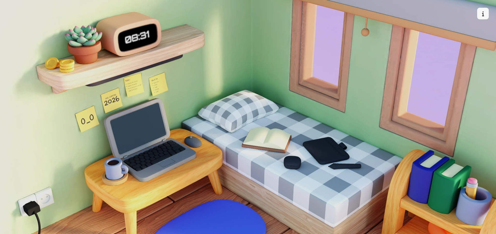

# Welcome to Yam Space 🙌
A cozy, minimal space with no fancy desk setup—so you can stay focused and get your daily tasks done 🥲. This interactive 3D portfolio explores how modern web technologies can create immersive, high-performance experiences directly in the browser. Built with Three.js and React, the project focuses on smooth interaction, visual clarity, and meaningful user engagement.

Rather than presenting work in a static layout, this portfolio invites visitors to navigate a 3D environment, interact with objects, and explore content in a more natural and memorable way—mirroring how people engage with real spaces.

---

# 🗝️ Key Features 
- Interactive 3D environment with free-hand navigation control
- Track your productivity time using Pomodoro Timer
- Draft your todays activity

# 💻 Technologies Used
- Three.js
- Next.js
- TypeScript
- Tailwind CSS
- GSAP

# 🎯 Project Goals
The primary goal of this project was to create a memorable portfolio experience that goes beyond traditional static websites. By combining 3D graphics with interactive web technologies, the portfolio allows visitors to explore my work in a way that feels engaging, intuitive, and immersive.

This project also serves as a technical showcase—demonstrating how modern frontend tools can be used to build interactive, performant, and scalable 3D experiences directly in the browser, without sacrificing usability or clarity.
